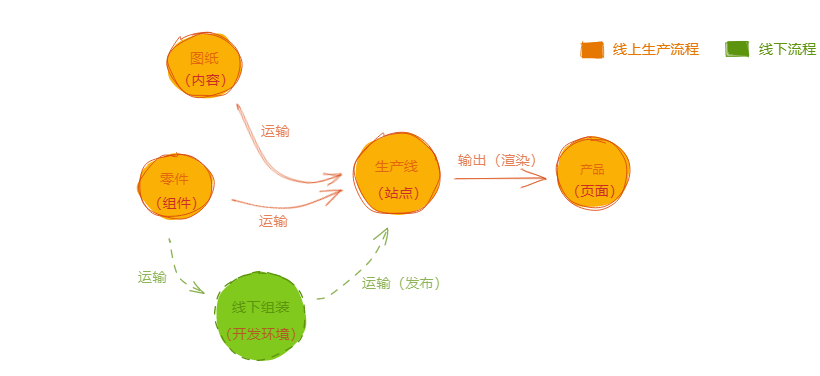

## 前言

xxxxx,sfdasjfla,水利局发链接，书法家李福建，沙 xxxxxsfsaf 是发发

## 什么是 xxxxx

web-document xxxxxxxx 说了句法垃圾了

## 特性

- 🖥 可视化，提供可视化的前端页面搭建，所见即所得
- 🏷 组件化，提供较为完善的组件制作流程和组件化方案，制作页面先从制作组件开始
- 📋 可扩展，提供多端，多技术栈及多种场景的支持
- 🌍 国际化，提供一套国际化内容管理的方案
- 📡 平台化，给开发者、编辑、运营等提供了一个在线合作的平台
